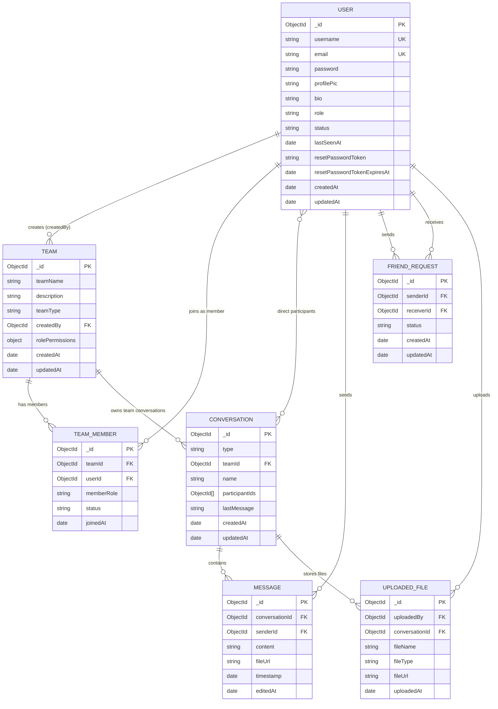

# Database Schema Design

This project uses MongoDB (via Mongoose). The Mermaid ER diagram below represents the current collection design from `backend/src/models`.

## Notes

- `TEAM_MEMBER` has a unique compound index on (`teamId`, `userId`).
- `FRIEND_REQUEST` has a unique partial index on (`senderId`, `receiverId`) where `status = "pending"`.
- `UPLOADED_FILE` model writes to the `files` collection.
- `CONVERSATION.participantIds` stores user references as an ObjectId array.
